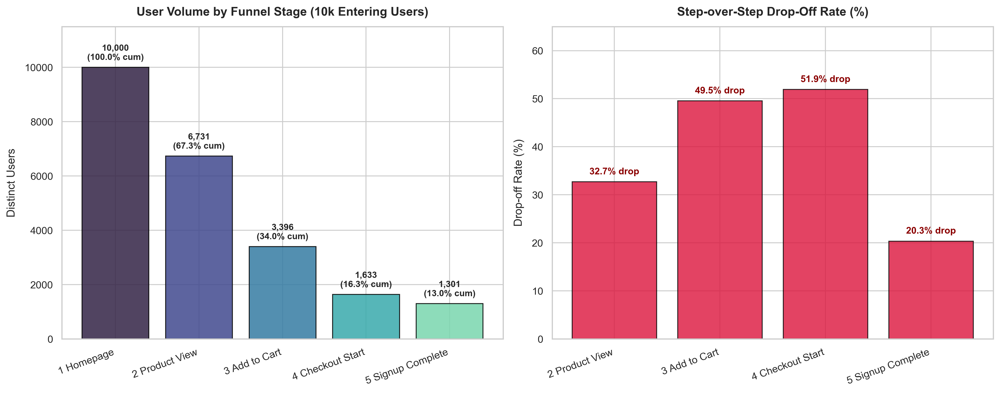
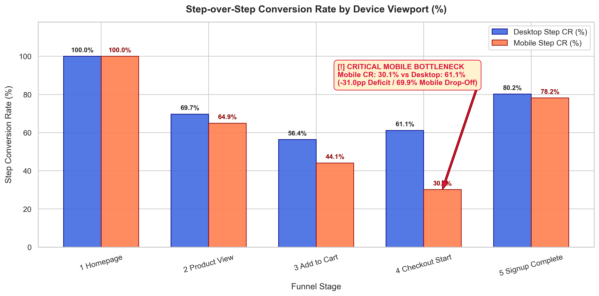
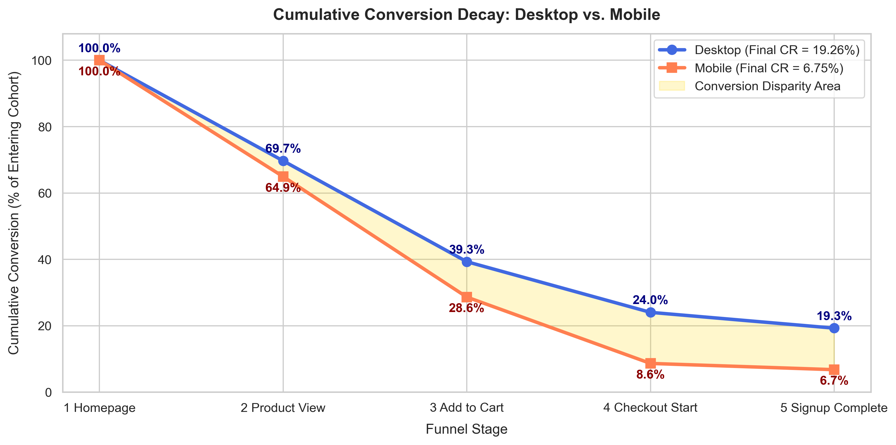

# Milestone 2 Findings: Multi-Step Funnel & Mobile Friction Analysis

**Author:** Lead Product Analytics Engineer  
**Date:** May 2024  
**Context:** Baseline Funnel Audit for Homepage Redesign Experiment  
**Companion Notebook:** [`notebook/02_funnel_analysis.ipynb`](../notebook/02_funnel_analysis.ipynb)  

---

### 1. Executive Summary & Problem Scope
Prior to deploying and interpreting the 50,000-user Homepage Redesign A/B Test, Growth and Product leadership required a clean baseline of the end-to-end customer journey across the 5 canonical stages:
$$\text{1\_Homepage} \longrightarrow \text{2\_Product\_View} \longrightarrow \text{3\_Add\_to\_Cart} \longrightarrow \text{4\_Checkout\_Start} \longrightarrow \text{5\_Signup\_Complete}$$

Using 26,061 raw clickstream event records from a 10,000-visitor cohort (generated via the embedded telemetry generator in [`02_funnel_analysis.ipynb`](../notebook/02_funnel_analysis.ipynb)), we audited stage transition rates, removed duplicate session pings, and segmented performance by device viewport (Desktop vs. Mobile). Our objective was to isolate platform-wide drop-offs from device-specific UX friction.

---

### 2. Telemetry Cleaning & Deduplication
Raw clickstream logs frequently record multiple pings per session due to page refreshes, repeated catalog searches, and back-and-forth navigation. Evaluating conversion on raw event rows produces distorted, non-monotonic metrics (often yielding invalid step conversion rates $>100\%$). 

By enforcing strict `(user_id, event_name)` deduplication:

| Metric | Telemetry Count | % of Raw Records |
| :--- | :---: | :---: |
| **Raw Ingested Records** | 26,061 | 100.00% |
| **Purged Duplicate Pings** | **3,000** | **11.51%** |
| **Deduplicated User-Stage Steps** | 23,061 | 88.49% |
| **Preserved Unique Visitors** | **10,000** | **100.00%** (5,004 Desktop, 4,996 Mobile) |

---

### 3. Overall Baseline Conversion Funnel

#### Summary Table: Chronological Funnel Progression
Tracking distinct users across the 5 sequential stages reveals a company-wide baseline conversion rate of **13.01%** (1,301 total conversions):

| Funnel Stage | Stage Name | Distinct Users | Step-over-Step CR | Step Drop-off Rate | Cumulative CR | Volume Lost |
| :--- | :--- | :---: | :---: | :---: | :---: | :---: |
| **1_Homepage** | Homepage | 10,000 | 100.00% | 0.00% | 100.00% | 0 |
| **2_Product_View** | Product View | 6,731 | 67.31% | 32.69% | 67.31% | 3,269 |
| **3_Add_to_Cart** | Add to Cart | 3,396 | 50.45% | 49.55% | 33.96% | 3,335 |
| **4_Checkout_Start** | Checkout Start | 1,633 | 48.09% | 51.91% | 16.33% | 1,763 |
| **5_Signup_Complete** | Signup Complete | 1,301 | 79.67% | 20.33% | 13.01% | 332 |

#### Key Observations:
- **Largest Absolute Volume Loss**: Occurs between **Homepage $\rightarrow$ Product View**, where **3,269 visitors drop out** (32.69% drop-off). This is typical of top-of-funnel discovery filtering.
- **Largest Percentage Drop-off**: Occurs between **Add to Cart $\rightarrow$ Checkout Start**, where **51.91% of high-intent cart holders abandon** (1,763 users lost).
- **Post-Checkout Efficiency**: Once users start checkout, **79.67% complete registration/payment**, demonstrating strong terminal purchase intent.

---

### 4. Device Segmentation: Isolating Mobile Friction
Slicing the funnel by device reveals that conversion friction is **not platform-wide or algorithmic**—it is overwhelmingly concentrated on **Mobile Viewports at Checkout Initiation**:

| Funnel Stage | Desktop Users | Desktop Step CR | Desktop Cum CR | Mobile Users | Mobile Step CR | Mobile Cum CR | Step CR Gap (pp) |
| :--- | :---: | :---: | :---: | :---: | :---: | :---: | :---: |
| **1_Homepage** | 5,004 | 100.00% | 100.00% | 4,996 | 100.00% | 100.00% | 0.00pp |
| **2_Product_View** | 3,487 | 69.68% | 69.68% | 3,244 | 64.93% | 64.93% | +4.75pp |
| **3_Add_to_Cart** | 1,966 | 56.38% | 39.29% | 1,430 | 44.08% | 28.62% | +12.30pp |
| **4_Checkout_Start** | **1,202** | **61.14%** | **24.02%** | **431** | **30.14%** | **8.63%** | **+31.00pp** |
| **5_Signup_Complete** | 964 | 80.20% | 19.26% | 337 | 78.19% | 6.75% | +2.01pp |
| **End-to-End Totals** | **964** | — | **19.26%** | **337** | — | **6.75%** | **+12.51pp (2.9× disparity)** |

#### Device Analysis Insights:
1. **Symmetric Top-of-Funnel Browsing**: Desktop and mobile display comparable discovery intent ($69.68\%$ vs. $64.93\%$ product view rates).
2. **The Checkout Initiation Collapse**: At **Add to Cart $\rightarrow$ Checkout Start**, mobile conversion plummets to **30.14%**, compared to **61.14% on Desktop**—a massive **31.00pp deficit** and a **69.86% mobile drop-off rate**.
3. **Terminal Parity**: Once checkout is initiated, mobile users convert at **78.19%**, nearly matching desktop (**80.20%**). The friction is strictly localized to the transition from the cart into the checkout screen.

---

### 5. Root-Cause Analysis & Counterfactual Opportunity Sizing

#### Root Cause Diagnosis:
- **Mobile Viewport Obstruction**: On mobile viewports (<768px), lengthy order summaries and sticky headers push the primary *"Proceed to Checkout"* CTA below the fold.
- **Form Ergonomics**: Mobile checkout requires users to navigate multi-step billing and shipping inputs without native OS auto-fill or 1-tap express options.

#### Counterfactual Opportunity Quantification:
What if product and engineering remediate mobile checkout UX so mobile step conversion reaches desktop parity ($61.14\%$)?

| Metric | Baseline (Actual) | Counterfactual (Parity) | Absolute Delta | Relative Lift |
| :--- | :---: | :---: | :---: | :---: |
| **Mobile Users Reaching Cart** | 1,430 | 1,430 | — | — |
| **Mobile Checkout Starts** | 431 (30.14% CR) | 874 (61.14% CR) | **+443 checkout starts** | **+102.8%** |
| **Mobile Completed Signups** | 337 (6.75% cum CR) | 683 (13.68% cum CR) | **+346 completed customers** | **+102.7%** |
| **Total Platform Signups** | 1,301 (13.01% cum CR) | 1,647 (16.47% cum CR) | **+346 completed customers** | **+26.59%** |

Remediating mobile checkout friction would directly unlock **+346 incremental customers**, generating an immediate **+26.59% lift** in company-wide customer acquisition.

---

### 6. Actionable Next Steps
1. **Immediate Mobile UI Remediation**: Pin a sticky *"Proceed to Checkout"* CTA above the mobile fold and simplify mobile cart views.
2. **One-Tap / Express Checkout**: Implement Apple Pay, Google Pay, and UPI express checkout directly on product and cart screens to bypass multi-step mobile form entry.
3. **A/B Testing Priority**: Launch a dedicated mobile checkout optimization experiment prior to or alongside the Homepage redesign rollout.
