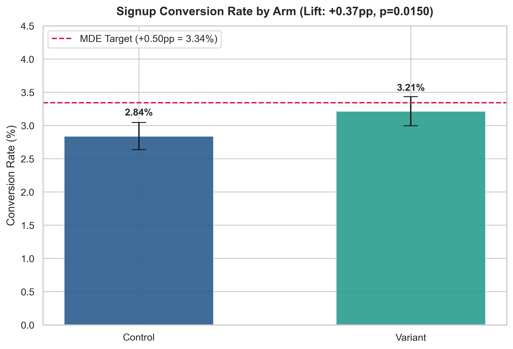
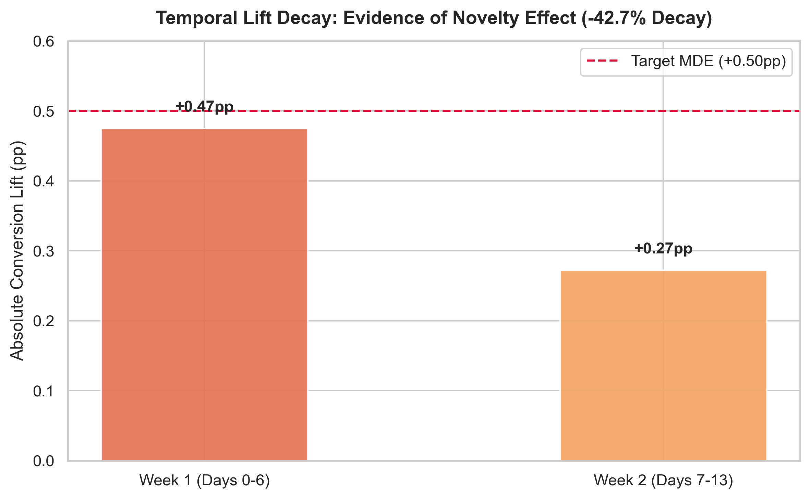
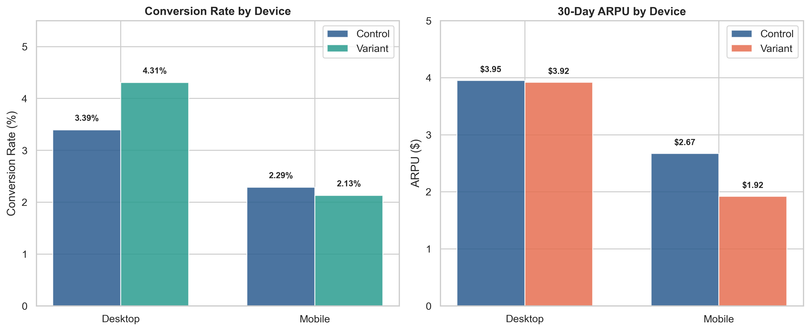

# Milestone 4 Findings: Experiment Diagnostics & Executive Decision Memo

**Author:** Lead Product Analytics Engineer  
**Date:** May 18, 2024  
**Context:** Homepage V2 Redesign A/B Test (EXP-2024-05) — 50,000 Users  
**Companion Notebook:** [`notebook/04_ab_test_evaluation.ipynb`](../notebook/04_ab_test_evaluation.ipynb)  

---

### Executive Decision Memorandum

```
=========================================================================================
MEMORANDUM | PRODUCT & GROWTH EXECUTIVE COMMITTEE
TO:        VP of Product, Head of Growth, Engineering Lead
FROM:      Lead Product Analytics Engineer
DATE:      May 18, 2024
SUBJECT:   EXPERIMENT AUDIT & SHIP DECISION: HOMEPAGE V2 REDESIGN
RECOMMENDATION: DO NOT SHIP GLOBALLY (CONDITIONAL DESKTOP-ONLY ROLLOUT)
=========================================================================================
```

---

### 1. Executive Summary Table

| Metric / Diagnostic Gate | Control ($N=25,053$) | Variant ($N=24,947$) | Delta / Lift | Test Statistic & $p$-Value | Status / Verdict |
| :--- | :--- | :--- | :--- | :--- | :--- |
| **Primary Metric: Signup Conversion** | $2.84\%$ ($712$) | $3.21\%$ ($802$) | **$+0.37\text{pp}$** ($+13.1\%$) | $Z = 2.43$, $p = 0.0150$ | ⚠️ Below MDE ($+0.50\text{pp}$) |
| **95% Wald Confidence Interval** | — | — | $[+0.07\text{pp}, +0.67\text{pp}]$ | $\alpha = 0.05$ | ⚠️ Lower bound near zero |
| **Desktop Segment Conversion** | $3.39\%$ ($426$) | $4.31\%$ ($535$) | **$+0.91\text{pp}$** ($+26.9\%$) | $Z = 3.75$, $p < 0.001$ | 🟢 Strong Winner |
| **Mobile Segment Conversion** | $2.29\%$ ($286$) | $2.13\%$ ($267$) | **$-0.16\text{pp}$** ($-6.9\%$) | $Z = -0.81$, $p = 0.421$ | 🔴 Regressed / Ineffective |
| **Guardrail Metric: 30-Day ARPU** | **$3.31** | **$2.92** | **-$0.39** ($-11.9\%$) | Welch's $t = -2.14$, $p = 0.0323$ | 🔴 Statistically Significant Drop |
| **Sample Ratio Mismatch (SRM)** | $25,053$ ($50.1\%$) | $24,947$ ($49.9\%$) | Expected 50/50 | $\chi^2 = 0.2247$, $p = 0.6355$ | 🟢 Gate Passed (No SRM) |
| **Temporal Stability (Novelty)** | W1: $+0.47\text{pp}$ | W2: $+0.27\text{pp}$ | $-0.20\text{pp}$ Fade | $-42.6\%$ decay rate | ⚠️ Novelty Wear-Off |



---

### 2. Situation: Experiment Context & The Growth Team's Claim
The Growth Team reported: *"Conversion lifted from 2.8% to 3.2% (p=0.015), we must ship immediately!"*

The experiment tracked 50,000 unique visitors randomly assigned across 14 days ($25,053$ Control vs. $24,947$ Variant). A Pearson Chi-Square test confirmed **zero Sample Ratio Mismatch** ($\chi^2 = 0.2247, p = 0.6355$). While headline conversion rose from $2.84\%$ to $3.21\%$ ($Z = 2.43, p = 0.0150$), shipping globally based solely on this aggregate metric would harm product revenue.

---

### 3. Complication: The Three Fatal Audit Findings

#### Failure Mode 1: Lift Fails Pre-Experiment MDE & Suffers Novelty Decay
* **MDE Shortfall**: The business case pre-registered a Minimum Detectable Effect of **$+0.50\text{pp}$**. The realized lift of **$+0.37\text{pp}$** fell $26\%$ short. The 95% Wald CI $[+0.07\text{pp}, +0.67\text{pp}]$ indicates true lift could be as low as $+0.07\text{pp}$.
* **Novelty Fade**: In Week 1, conversion lift was **$+0.47\text{pp}$** ($3.37\%$ vs $2.90\%$). In Week 2, lift collapsed to **$+0.27\text{pp}$** ($3.05\%$ vs $2.78\%$)—a **$42.6\%$ decay**. The initial spike was driven by curiosity rather than sustained behavioral change.



#### Failure Mode 2: Severe Monetization Guardrail Breach (ARPU Drop)
* 30-Day ARPU dropped from **$3.31** in Control to **$2.92** in Variant, representing a net loss of **-$0.39 per visitor (-11.9%)**.
* Welch's Two-Sample T-Test (`equal_var=False`) confirms this drop is **statistically significant** ($t = -2.14, p = 0.0323 < 0.05$).
* Among converted users, average spend dropped by **$22.2\%$** ($116.59 Control vs. $90.71 Variant). The redesigned hero copy attracted lower-intent users with smaller basket sizes.

#### Failure Mode 3: Simpson's Paradox & Mobile Regression
* **Desktop Users (50% traffic)**: Clear success. Conversion jumped from $3.39\%$ to $4.31\%$ (**$+0.91\text{pp}$**, $+26.9\%$, $p < 0.001$) while ARPU held steady ($3.95 vs $3.92).
* **Mobile Users (50% traffic)**: Total failure. Conversion dropped from $2.29\%$ to $2.13\%$ (**$-0.16\text{pp}$**, $-6.9\%$, $p = 0.421$) and ARPU cratered from **$2.67** to **$1.92** (**-$0.75**, $-28.1\%$). The multi-column hero card pushed the primary call-to-action below the fold on mobile viewports.



---

### 4. Resolution: Decision & Strategic 3-Point Action Plan

#### Executive Decision: **DO NOT SHIP GLOBALLY**

#### Action Plan:
1. **Conditional Desktop-Only Rollout**: Deploy Homepage V2 exclusively to desktop devices to capture the verified $+26.9\%$ conversion boost without hurting monetization.
2. **Mobile Rollback & Viewport Remediation**: Revert mobile traffic to Control immediately. Redesign the mobile view to pin the primary signup CTA above the fold, remediating the friction identified in Milestone 2.
3. **Monetization Protection Gate**: Implement premium tier discovery prompts during onboarding for variant users to recover the $22.2\%$ drop in converted user spend before any future global rollout.
